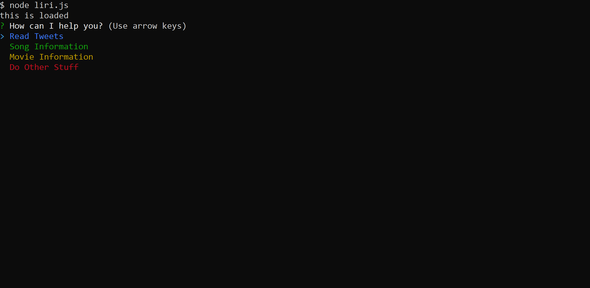

# liri-node-app

First assignment/project using Node.js to create a personal assistant that can get some information on Songs, movies or get the last 20 tweets from a public account. Enjoy!

## Built using:

Javascript, Node.js

Npms - Twitter, Spotify, Inquirer, Moment, Fs, Request, Chalk

## Built and Maintained by:

### Gustavo Gibo